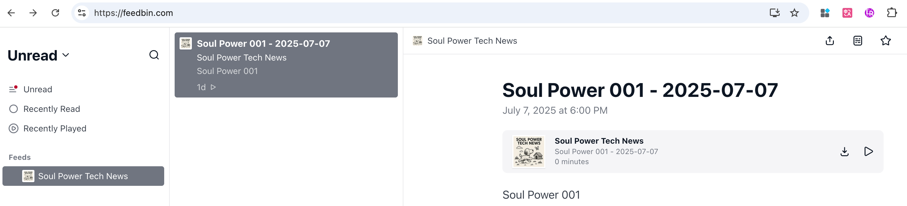

# 🎙️ Daily Tech Podcast

Daily Tech Podcast is an automated podcast content generation system built with n8n, FastAPI, and a custom RSS pipeline. It fetches tech news daily, summarizes it, converts it to audio, and publishes it through an RSS feed—ready for distribution to podcast platforms like Apple Podcasts.

---

## ✨ Features
* 🔄 Automated news fetch & summarization (powered by n8n)
* 🗣️ TTS (Text-to-Speech) synthesis using Minimax / Kokoro
* 📦 FastAPI backend for audio generation & RSS XML updates
* 🌐 Public API exposure with ngrok (for n8n compatibility)
* 📡 Auto-generated RSS feed for podcast clients


--- 
## 📦 Project Structure

### 1. News Workflow with n8n
* n8n handles:
   * Scheduled fetching of tech news from official platforms
   * Summarization via language model
   * HTTP request to FastAPI service to generate audio
* To import the n8n workflow:
   * Open n8n.io or your self-hosted instance
   * Import the workflow JSON template (/n8n/daily_tech_workflow.json)
   * Configure credentials if needed
   * Execute the pipeline or set it on a daily schedule

### 2. TTS Audio Generation with FastAPI

By default, the project uses Minimax for TTS. For local development, you can use the [Kokoro TTS project]((https://github.com/remsky/Kokoro-FastAPI.git)):
```bash 
docker run -p 8880:8880 ghcr.io/remsky/kokoro-fastapi-cpu:latest
```

Then, send test audio request:
```bash 
curl -X 'POST' \
     'http://localhost:8880/v1/audio/speech' \
     -H 'Content-Type: application/json' \
     -H 'Accept: audio/mp3' \
     -d '{
     "model": "kokoro",
     "input": "今天是2025年7月7日",
     "voice": "zm_yunyang",
     "response_format": "mp3",
     "download_format": "mp3",
     "speed": 1,
     "stream": true,
     "return_download_link": false,
     "lang_code": "z",
     "volume_multiplier": 1,
     "normalization_options": {
       "normalize": true,
       "unit_normalization": false,
       "url_normalization": true,
       "email_normalization": true,
       "optional_pluralization_normalization": true,
       "phone_normalization": true,
       "replace_remaining_symbols": true
     }
   }' --output speech.mp3
```

### 3. RSS Feed Generation with podgen
* RSS feeds are generated using podgen.
* Each time new content is created:
* Audio is uploaded to GitHub
* RSS XML is regenerated and pushed

Test your feed on:
* Feedbin
* Inoreader

✅ If it renders properly, it will also be accepted by Apple Podcasts and other platforms.
   

---
##  Apple Podcasts Submission
To register your podcast:
1.	Visit [Apple Podcasts Connect](https://podcastsconnect.apple.com/)
2.	Click the “+” button → New Show → Add a show with an RSS feed
3.	Paste the public RSS link generated by this project
4.	Review and submit


## ❤️ Inspiration

This project was inspired by my love for《声动早咖啡》. While I enjoy the format, I couldn’t find a similar show focusing on political and economic news—so I decided to build my own with automation. Stay tuned for upcoming spin-offs in these categories!
